# Robust Satellite Image Classification under Brightness Variation and Atmospheric Haze
**ECE 046217 – Deep Learning Project (Technion)**

**Authors:**  
Anil Zaher  
Taymor Sabek

## Overview

Satellite image classifiers are often deployed on imagery that is not clean:
brightness varies, haze reduces contrast, and acquisition conditions change
over time. This project examines how common pretrained backbones behave when
the input is degraded in ways that resemble realistic satellite conditions.

We compare three representation paradigms for EuroSAT land-use classification:
a convolutional neural network (ResNet-50), a supervised Vision Transformer
(ViT-Base), and a self-supervised Vision Transformer (DINOv3) used as a frozen
feature extractor with a linear classifier. ResNet-50 and ViT-Base are
fine-tuned end-to-end, while DINOv3 is evaluated via linear probing.

Robustness is evaluated under two test-time degradations: brightness scaling
and synthetic atmospheric haze. Although all models perform well on clean
data, their performance diverges under strong degradation.


## Repository Structure

```text
project-root/
├── data/
│   ├── raw/                     # Raw EuroSAT data (downloaded automatically)
│   └── splits/                  # Stratified train/val/test splits
│
├── models/
│   ├── backbones.py             # Model definitions (ResNet-50, ViT-Base, DINOv3)
│   ├── checkpoints/             # Auto-generated during Optuna tuning
│   └── logs/                    # Auto-generated metrics and Optuna studies
│
├── saves/
│   ├── checkpoints/             # Final saved checkpoints (ResNet-50, ViT-Base)
│   └── logs/                    # Final metrics and Optuna studies
│
├── scripts/
│   └── data_setup.py            # Dataset download and split creation
│
├── utils/
│   ├── data_utils.py            # Dataset loading utilities
│   ├── trainer.py               # Training and validation loops
│   ├── tune_utils.py            # Optuna hyperparameter optimization
│   └── viz_utils.py             # Visualization and robustness utilities
│
├── notebooks/
│   ├── data_visualization.ipynb # Main analysis and figure generation
│   ├── model_tuning.ipynb      # Hyperparameter tuning
│   └── model_test.ipynb         # Debugging / GPU sanity checks
│
├── plots/                       # Figures used in the README and report
│
└── README.md
```

## Dataset

We use the EuroSAT RGB dataset, which contains approximately 27,000 satellite
images across 10 land-use classes. We create stratified train, validation,
and test splits. All images are resized to 224×224 and normalized using
ImageNet statistics to match pretrained model expectations.

### Dataset Setup

Run once from the project root:

```bash
python scripts/data_setup.py
```
This script downloads the EuroSAT dataset if it is not already present and
creates stratified train/validation/test splits under data/splits/

### Dataset Visualization

<p align="center">
  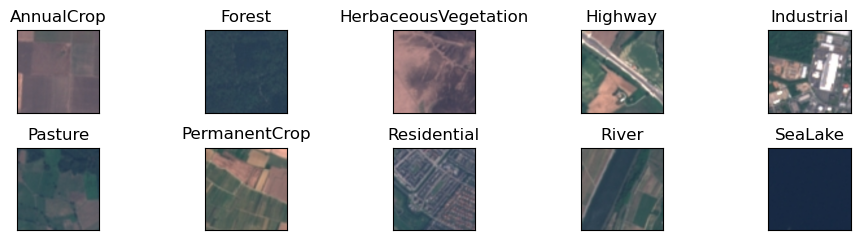
</p>

<p align="center">
  <em>
    Figure 1: Representative RGB samples from each EuroSAT class. Some classes
    exhibit strong visual similarity (e.g., AnnualCrop and PermanentCrop),
    while others are dominated by large-scale geometric structures
    (e.g., Highway and Residential).
  </em>
</p>

## Models

We evaluate three pretrained backbones for EuroSAT land-use classification.

### ResNet-50 (fine-tuned)

We start from an ImageNet-pretrained ResNet-50, replace the final classification
layer to output 10 classes, and fine-tune all parameters end-to-end on EuroSAT.

### ViT-Base (fine-tuned)

We use an ImageNet-pretrained ViT-Base model, replace the classification head,
and fine-tune the full model end-to-end on EuroSAT.

### DINOv3 (linear probe)

We use a DINO-family Vision Transformer backbone (DINOv3) as a frozen feature
extractor. Only a linear classifier on top of the CLS embedding is trained.

## Training and Hyperparameter Optimization

All models are trained using cross-entropy loss. We tune learning rate,
weight decay, and optimizer choice (SGD vs. AdamW) using Optuna, selecting
the configuration with the best validation accuracy for final test
evaluation. Also, a learning-rate scheduler is used during training for
stability.

## Training Curves

<p align="center">
  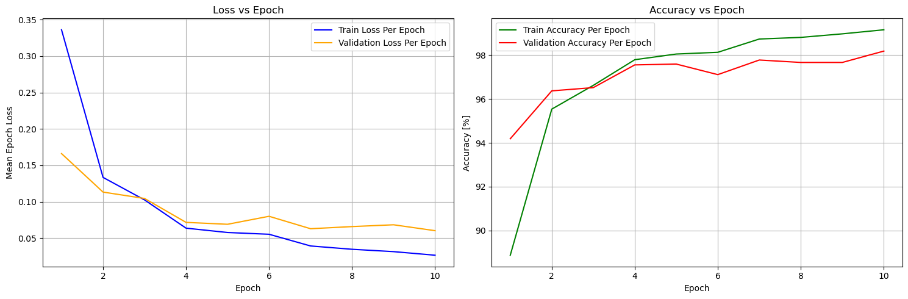
</p>
<p align="center">
  <em>
  Figure 2: Training and validation loss and accuracy as a function of epoch
  for ResNet-50.
  </em>
</p>

<p align="center">
  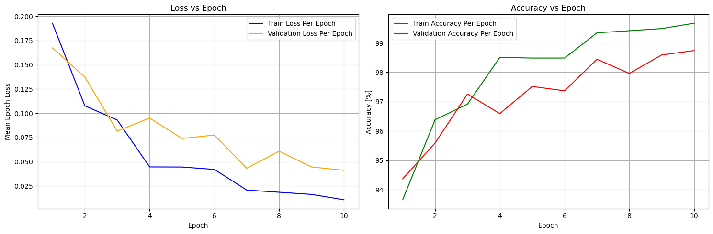
</p>
<p align="center">
  <em>
  Figure 3: Training and validation loss and accuracy as a function of epoch
  for ViT-Base.
  </em>
</p>

<p align="center">
  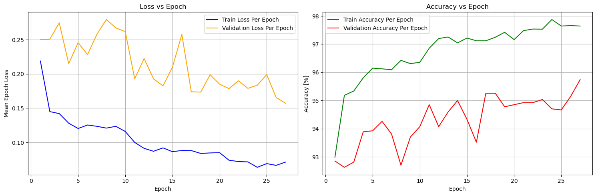
</p>
<p align="center">
  <em>
  Figure 4: Training and validation loss and accuracy as a function of epoch
  for DINOv3 using linear probing.
  </em>
</p>

The training curves illustrate convergence behavior and stability for each
model under the selected hyperparameter configuration.

## Hyperparameter Search Visualization

<p align="center">
  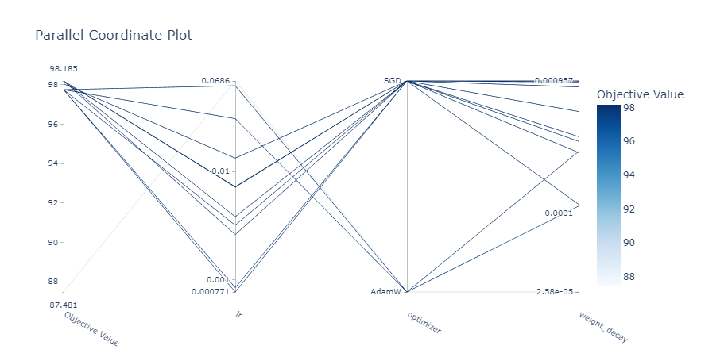
</p>

<p align="center">
  <em>
  Figure 5: Parallel coordinate plot of the Optuna hyperparameter search for
  ResNet-50. Each line corresponds to one trial, showing the relationship
  between learning rate, weight decay, optimizer choice, and validation
  accuracy.
  </em>
</p>

This visualization provides a representative view of the hyperparameter
search space and its impact on performance. Equivalent Optuna visualizations
for ViT-Base and DINOv3, including optimization history and parameter
importance plots, are provided in the
<code>model_tuning.ipynb</code> notebook.

## Robustness Evaluation

Robustness is evaluated under two degradations: brightness scaling and
synthetic haze. Perturbations are applied only at test time.

Training uses standard geometric augmentation: resize to 256×256, random
crop to 224×224, random horizontal and vertical flips, and random rotations
up to 90°. These augmentations promote spatial invariance, but they do not
explicitly train on brightness or haze distortions.

Brightness is simulated by multiplying pixel intensities by a factor and
clamping values to [0, 1]. Synthetic haze is simulated by blending the image
with a uniform white haze component. For each severity level, we report
classification accuracy and compare trends relative to the clean baseline.

## Visual Examples of Perturbations

<p align="center">
  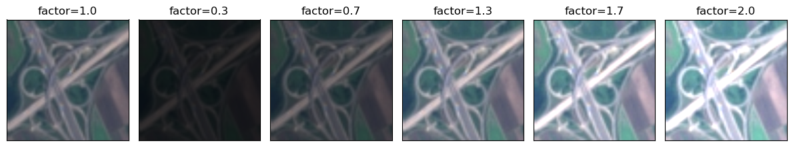
</p>
<p align="center">
  <em>(a) Brightness scaling.</em>
</p>

<p align="center">
  
</p>
<p align="center">
  <em>(b) Synthetic haze at increasing severity.</em>
</p>

<p align="center">
  <em>
  Figure 6: Visual examples of the perturbations used for robustness evaluation
  on a representative <code>Highway</code> image. Brightness scaling primarily
  affects global illumination, while haze progressively reduces contrast and
  fine detail.
  </em>
</p>

## Clean Performance

We first evaluate all models on clean test data. ResNet-50 and ViT-Base reach
similarly high accuracy after end-to-end fine-tuning. DINOv3 achieves slightly
lower clean accuracy under linear probing, which is expected since the backbone
is frozen and only a linear classifier is trained.

| Model                     | Accuracy (%) |
|---------------------------|--------------|
| ResNet-50 (fine-tuned)    | 98.29        |
| ViT-Base (fine-tuned)     | 98.37        |
| DINOv3 (linear probe)     | 95.48        |

## Robustness to Brightness Variation

<p align="center">
  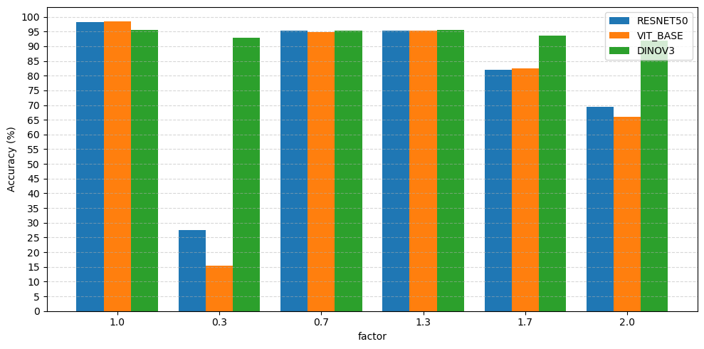
</p>

<p align="center">
  <em>
  Figure 7: Test accuracy as a function of brightness severity.
  </em>
</p>

ResNet-50 and ViT-Base remain stable near the clean setting but degrade
substantially under extreme darkening, where class-specific cues largely
disappear. DINOv3 degrades more gradually and maintains higher accuracy
at severe brightness levels, despite starting from a lower clean baseline.

## Robustness to Atmospheric Haze

<p align="center">
  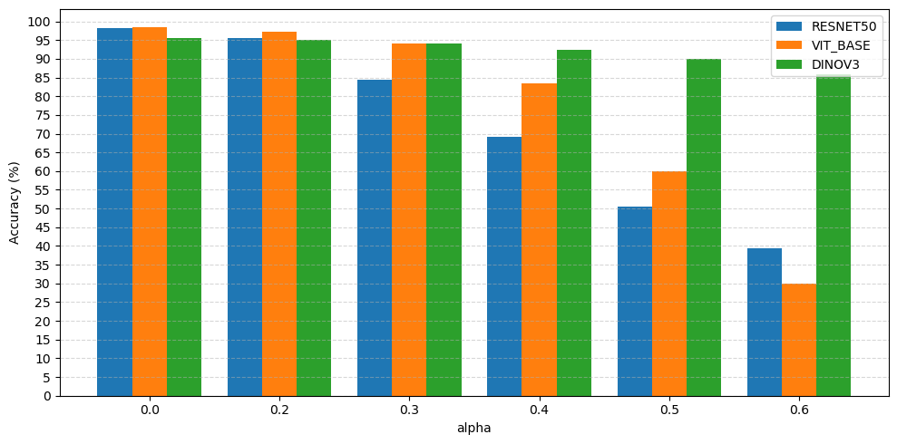
</p>

<p align="center">
  <em>
  Figure 8: Test accuracy as a function of synthetic haze severity.
  </em>
</p>

All models remain close to their clean performance at low haze levels
(alpha ≤ 0.2). As haze increases, ResNet-50 degrades sharply, ViT-Base degrades
more gradually, and DINOv3 shows the smallest drop, maintaining higher
accuracy at severe haze despite a lower clean baseline.

## Qualitative Interpretability Analysis

<p align="center">
  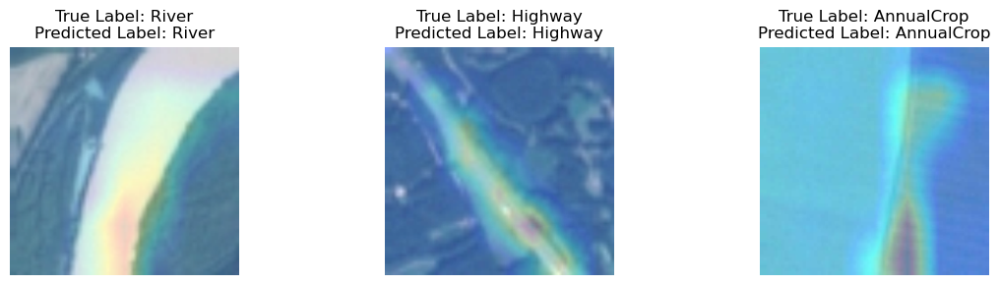
</p>
<p align="center">
  <em>(a) Grad-CAM visualization for ResNet-50.</em>
</p>

<p align="center">
  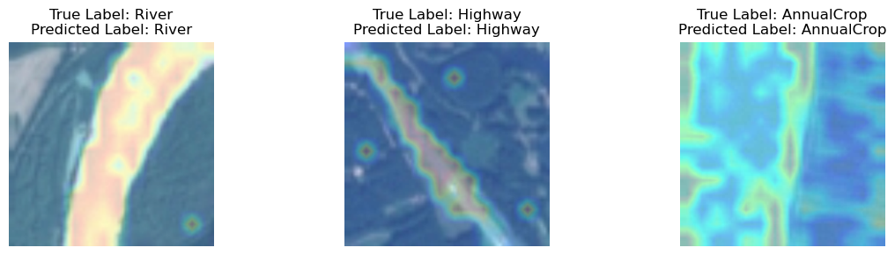
</p>
<p align="center">
  <em>(b) Attention map for ViT-Base.</em>
</p>

<p align="center">
  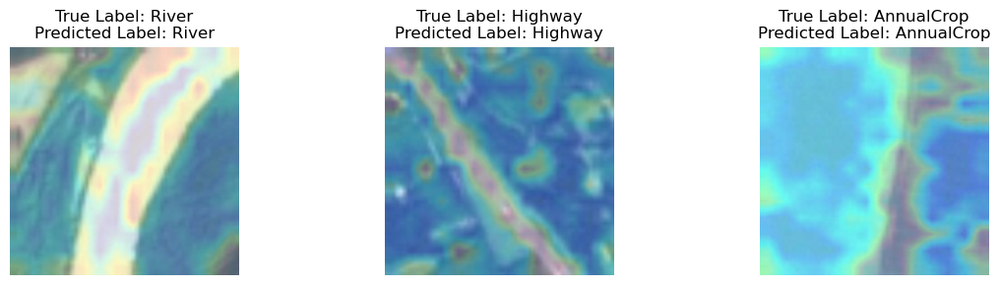
</p>
<p align="center">
  <em>(c) Attention map for DINOv3.</em>
</p>

<p align="center">
  <em>
  Figure 9: Grad-CAM visualizations for ResNet-50 and attention maps for
  ViT-Base and DINOv3 on representative test images.
  </em>
</p>


Grad-CAM for ResNet-50 tends to focus on smaller, localized regions, while
transformer attention is spread across larger parts of the scene. DINOv3
attention is broader and smoother, but still highlights meaningful
structures, such as roads and rivers.

## How to Run

This section describes the steps required to reproduce the experiments and
figures in this project.

### 1. Environment setup

Install the required Python libraries:

- Python >= 3.9
- torch
- torchvision
- transformers
- huggingface_hub
- timm
- optuna
- numpy
- scipy
- scikit-learn
- pandas
- pillow
- opencv-python
- matplotlib
- seaborn
- tqdm
- grad-cam
- ttach
- jupyterlab
- ipywidgets


### 2. Dataset setup
Download the EuroSAT dataset and create stratified train, validation, and test
splits:

```bash
python scripts/data_setup.py
```
### 3. Hyperparameter tuning (optional)
Hyperparameter tuning is performed using Optuna. To run the tuning procedure
and save the resulting configurations and logs, open:

```bash
notebooks/model_tuning.ipynb
```

This notebook performs independent hyperparameter searches for each model and
saves checkpoints and metrics. Additional Optuna visualizations beyond those
shown in the README are available in this notebook.

#### Checkpoint and log directory handling

During hyperparameter tuning and training, model checkpoints and Optuna logs
are written to the default directories under `models/checkpoints` and
`models/logs`.

After training is complete, the best-performing checkpoints and corresponding
logs are manually moved to:

- `saves/checkpoints` (model weights)
- `saves/logs` (training metrics and Optuna studies)

All evaluation and visualization notebooks expect the final results to be
available under the `saves/` directory.

If the checkpoints and logs are not moved manually, update the directory paths
at the top of each notebook or script to point to the `models/` directories
instead. In this project, the final checkpoints and logs were moved manually
to the `saves/` directory to prevent them from being overwritten by subsequent
training or hyperparameter tuning runs, for example:

```python
CHECKPOINTS_DIR = "models/checkpoints"
LOGS_DIR = "models/logs"
```

### 4.Main analysis and visualization

All quantitative and qualitative results presented in the report and in this
README are generated in:

```bash
notebooks/data_visualization.ipynb
```

This notebook:
- visualizes the dataset
- loads the best model checkpoints and logs
- evaluates clean test performance
- evaluates robustness under brightness variation and synthetic haze
- generates robustness plots
- generates qualitative interpretability visualizations

The notebook assumes that the final checkpoints and logs are available under
the `saves/` directory, as described above.

---

### 5. Running with or without DINOv3

DINOv3 is loaded from Hugging Face and requires accepting the DINO Materials
License by Meta. DINOv3 weights are not included in this repository.

To run experiments **with** DINOv3:
- keep `"dinov3"` in the model list used in the notebooks

To run experiments **without** DINOv3:
- remove `"dinov3"` from the model list in the notebooks

All experiments and visualizations will run normally using ResNet-50 and
ViT-Base only. No other code changes are required.


## References

[1] P. Helber, B. Bischke, A. Dengel, and D. Borth,
Introducing EuroSAT: A Novel Dataset and Deep Learning Benchmark for Land Use and Land Cover Classification,
IEEE International Geoscience and Remote Sensing Symposium (IGARSS), 2018.

[2] K. He, X. Zhang, S. Ren, and J. Sun,
Deep Residual Learning for Image Recognition,
IEEE Conference on Computer Vision and Pattern Recognition (CVPR), 2016.

[3] A. Dosovitskiy, L. Beyer, A. Kolesnikov, et al.,
An Image Is Worth 16×16 Words: Transformers for Image Recognition at Scale,
arXiv preprint arXiv:2010.11929, 2021.

[4] O. Siméoni, H. V. Vo, M. Seitzer, et al.,
DINOv3,
arXiv preprint arXiv:2508.10104, 2025.

[5] T.-D. Le, V. N. Ha, T. T. Nguyen, et al.,
Onboard Satellite Image Classification for Earth Observation: A Comparative Study of ViT Models,
arXiv preprint arXiv:2409.03901, 2025.